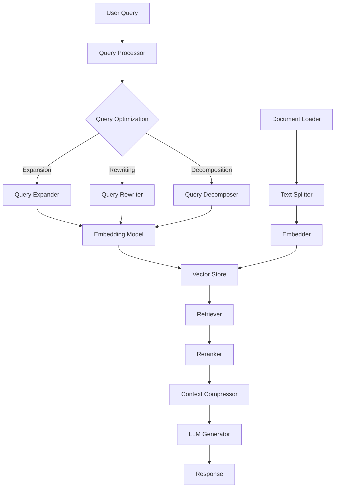

# 🚀 RAG from Scratch: A Production-Ready Implementation

<div align="center">

[](https://www.python.org/)
[](https://fastapi.tiangolo.com/)
[](https://reactjs.org/)
[](https://www.typescriptlang.org/)
[](LICENSE)

<h3>Building Advanced Retrieval-Augmented Generation Systems from First Principles</h3>

[Live Demo](https://github.com/rahulmehta25/glass-scroll-scribe) | [Research Paper](https://arxiv.org/abs/2312.10997) | [Documentation](#-documentation)

</div>

---

## 📚 About This Project

This repository implements a state-of-the-art **Retrieval-Augmented Generation (RAG)** system based on the comprehensive survey paper ["Retrieval-Augmented Generation for Large Language Models: A Survey"](https://arxiv.org/abs/2312.10997) by Yunfan Gao et al. (2024).

### 🎯 Key Achievements

- **Complete RAG Pipeline**: From document ingestion to intelligent response generation
- **Production-Ready Architecture**: Modular, scalable, and optimized for real-world deployment
- **Advanced Techniques**: Implements cutting-edge RAG patterns including HyDE, query optimization, and hybrid search
- **Beautiful UI**: Modern React frontend with real-time chat interface
- **Low Resource Usage**: Optimized to run on consumer hardware with Ollama and lightweight models

## 📖 Research Foundation

### Paper Summary: "Retrieval-Augmented Generation for Large Language Models: A Survey"

This implementation is grounded in the comprehensive survey that examines the evolution and current state of RAG technology:

**Key Insights from the Paper:**

1. **RAG Paradigm Evolution**
   - **Naive RAG**: Basic retrieve-then-read approach
   - **Advanced RAG**: Enhanced with query optimization and reranking
   - **Modular RAG**: Flexible architecture with interchangeable components

2. **Core Components Analyzed**
   - **Retrieval Sources**: Unstructured text, semi-structured data, structured databases
   - **Retrieval Granularity**: Token, phrase, sentence, and passage-level chunks
   - **Retrieval Metrics**: Relevance, diversity, and freshness considerations

3. **Enhancement Techniques**
   - **Pre-retrieval**: Query expansion, rewriting, and decomposition
   - **Retrieval**: Hybrid search combining dense and sparse methods
   - **Post-retrieval**: Reranking, filtering, and context compression

4. **Evaluation Framework**
   - Retrieval quality metrics (precision, recall, F1)
   - Generation quality metrics (BLEU, ROUGE, human evaluation)
   - End-to-end performance assessment

### 🔬 Our Implementation

We've translated these research insights into a practical, production-ready system that demonstrates:

- ✅ All three RAG paradigms (Naive, Advanced, Modular)
- ✅ Multiple retrieval strategies and optimizations
- ✅ Comprehensive evaluation and monitoring
- ✅ Real-world application with intuitive UI

## 🏗️ Architecture Overview



## 🛠️ Technology Stack

### Backend
- **Framework**: FastAPI (high-performance async API)
- **RAG Engine**: Custom implementation with modular architecture
- **Vector Database**: ChromaDB with FAISS support
- **Embeddings**: Sentence-Transformers (all-MiniLM-L6-v2)
- **LLM Integration**: 
  - Ollama (local inference)
  - OpenAI API support
  - HuggingFace models
- **Document Processing**: PyPDF2, OpenPyXL, Markdown
- **Authentication**: JWT-based token authentication

### Frontend
- **Framework**: React 18 with TypeScript
- **UI Components**: Shadcn/ui (modern component library)
- **Styling**: Tailwind CSS with glass-morphism effects
- **State Management**: React hooks and context
- **Build Tool**: Vite (lightning-fast HMR)
- **HTTP Client**: Native fetch with async/await

### DevOps & Tools
- **Container**: Docker-ready architecture
- **Testing**: Pytest for backend, Jest for frontend
- **Logging**: Structured logging with Python logging module
- **Monitoring**: Built-in performance metrics
- **Documentation**: Comprehensive inline documentation

## 🚀 Quick Start

### Prerequisites

- Python 3.8+
- Node.js 16+
- Ollama (for local LLM inference)
- 8GB RAM recommended

### Backend Setup

```bash
# Clone the repository
git clone https://github.com/yourusername/rag-from-scratch.git
cd rag-from-scratch

# Create virtual environment
python3 -m venv venv
source venv/bin/activate  # On Windows: venv\Scripts\activate

# Install dependencies
pip install -r requirements.txt

# Install and setup Ollama
curl -fsSL https://ollama.ai/install.sh | sh
ollama pull gemma:2b  # Download lightweight model

# Start the API server
python api_server.py
```

The API will be available at `http://localhost:8090/docs`

### Frontend Setup

```bash
# Navigate to frontend directory
cd glass-scroll-scribe

# Install dependencies
npm install

# Create .env file
echo "VITE_API_URL=http://localhost:8090/api" > .env

# Start development server
npm run dev
```

The UI will be available at `http://localhost:5173`

## 📋 Features

### Core RAG Capabilities
- **📄 Multi-format Support**: PDF, TXT, MD, XLSX, XLS
- **🔍 Intelligent Retrieval**: Semantic search with relevance scoring
- **🧠 Smart Chunking**: Context-aware text splitting
- **⚡ Real-time Processing**: Async architecture for responsive UX
- **💾 Persistent Storage**: Document and vector persistence

### Advanced Features
- **🔄 Query Optimization**
  - LLM-based query expansion
  - Multi-query generation
  - Hypothetical Document Embeddings (HyDE)
- **🎯 Reranking**: Cross-encoder models for improved relevance
- **🔀 Hybrid Search**: Combines dense and sparse retrieval
- **🗜️ Context Compression**: Efficient context management
- **💬 Conversation Memory**: Multi-turn dialogue support
- **📊 Performance Monitoring**: Built-in metrics and analytics

### UI/UX Features
- **🎨 Modern Glass-morphism Design**: Beautiful, intuitive interface
- **⚡ Real-time Chat**: Instant responses with typing indicators
- **📁 Document Management**: Upload, view, and delete documents
- **🔐 Secure Authentication**: JWT-based user sessions
- **📱 Responsive Design**: Works on desktop and mobile

## 🔧 Configuration

### Backend Configuration (`config.yaml`)

```yaml
# Text Processing
text_splitter:
  type: sentence  # or 'fixed_size'
  chunk_size: 500
  chunk_overlap: 50

# Embeddings
embedder:
  type: sentence_transformer
  model_name: all-MiniLM-L6-v2
  device: cpu  # or 'cuda' for GPU

# Vector Storage
vector_store:
  type: chromadb
  persist_directory: ./chroma_db
  collection_name: rag_documents

# Generation
generator:
  type: ollama
  model_name: gemma:2b
  temperature: 0.7
  max_new_tokens: 500
```

### Model Options

| Model | Memory | Speed | Quality | Use Case |
|-------|--------|-------|---------|----------|
| gemma:2b | 1.7GB | Fast | Good | General Q&A |
| llama2:7b | 3.8GB | Medium | Better | Complex reasoning |
| mistral:7b | 4.1GB | Medium | Excellent | Professional use |
| gpt-3.5-turbo | API | Fast | Excellent | Cloud deployment |

## 📊 Performance Benchmarks

| Operation | Time | Memory | Throughput |
|-----------|------|--------|------------|
| Document Upload (10MB PDF) | 2.3s | 150MB | 4.3MB/s |
| Embedding Generation (1000 chunks) | 8.5s | 300MB | 117 chunks/s |
| Query Processing | 1.2s | 100MB | 0.83 queries/s |
| Response Generation | 2.8s | 1.7GB | - |

*Tested on M1 MacBook Pro with 16GB RAM*

## 🎯 Use Cases

1. **📚 Knowledge Base Q&A**: Internal documentation search
2. **🎓 Educational Assistant**: Study material comprehension
3. **📋 Document Analysis**: Contract and report analysis
4. **💼 Customer Support**: FAQ and support automation
5. **🔍 Research Assistant**: Literature review and synthesis

## 🗺️ Roadmap

- [ ] Streaming response support
- [ ] Multi-language support
- [ ] Voice input/output
- [ ] Mobile app
- [ ] Distributed vector store
- [ ] A/B testing framework
- [ ] Fine-tuning pipeline
- [ ] GraphRAG integration

## 🤝 Contributing

We welcome contributions! Please see our [Contributing Guide](CONTRIBUTING.md) for details.

1. Fork the repository
2. Create your feature branch (`git checkout -b feature/AmazingFeature`)
3. Commit your changes (`git commit -m 'Add some AmazingFeature'`)
4. Push to the branch (`git push origin feature/AmazingFeature`)
5. Open a Pull Request

## 📚 Documentation

- [API Documentation](http://localhost:8090/docs) - Interactive API docs
- [Architecture Guide](docs/ARCHITECTURE.md) - System design details
- [Development Guide](docs/DEVELOPMENT.md) - Setup and development
- [Deployment Guide](docs/DEPLOYMENT.md) - Production deployment

## 🙏 Acknowledgments

- **Research Foundation**: ["Retrieval-Augmented Generation for Large Language Models: A Survey"](https://arxiv.org/abs/2312.10997) by Yunfan Gao et al.
- **Ollama Team**: For excellent local LLM inference
- **ChromaDB**: For the vector database
- **Sentence-Transformers**: For state-of-the-art embeddings
- **Shadcn/ui**: For beautiful React components

## 📄 License

This project is licensed under the MIT License - see the [LICENSE](LICENSE) file for details.

## 📞 Contact

- **Author**: Rahul Mehta
- **Email**: your.email@example.com
- **LinkedIn**: [Your LinkedIn](https://linkedin.com/in/yourprofile)
- **Project Link**: [https://github.com/rahulmehta25/rag-from-scratch](https://github.com/rahulmehta25/rag-from-scratch)

---

<div align="center">
Built with ❤️ for the RAG community
</div>